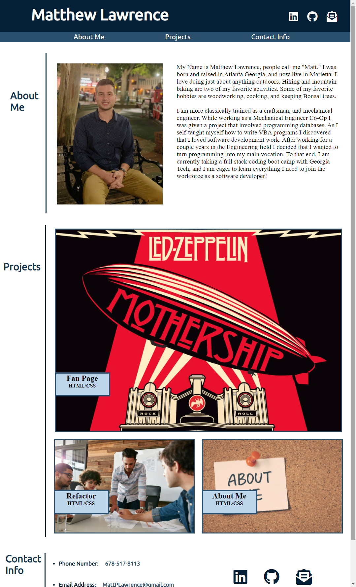

# GT-AdvancedCSS-Portfolio
Homework #2 for GT code camp. First portfolio. COmpleted by Matthew Lawrence.

## Host Location:
https://mattplawrence.github.io/GT-AdvancedCSS-Portfolio/

## Purpose:
The purpose of this project was to create a personal portfolio from scratch using CSS and HTML.

## Problem:
In this project I solved the problem of using best practices to create and HTML index document, and styling it with a style.css document. 

### The problems encountered include:
* Creating an HTML index from scratch, laid out in a concise, and ordered format.
* Using flexbox and other display types to get a clear layout.
* Using media queries to adapt the layout of the page to different screen layouts.
* Adding a Favicon to the HTML page.

## What I learned:
I learned that there are a lot oof different ways to accomplish the same thing. Additionally I grew my understanding of how CSS works, and can be adapted to fit your page.

## Preview:
The website landing page as written in this repository should look like the following image:

